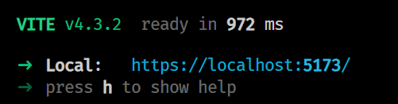

# 🏒 HockeyPickup.App

[](https://hockeypickup.com)

[](https://github.com/HockeyPickup/HockeyPickup.App/actions/workflows/azure-static-web-app.yml)
[](https://github.com/HockeyPickup/HockeyPickup.App/actions/workflows/github-code-scanning/codeql)

## 🌈 Overview

HockeyPickup.App is the primary frontend for [Hockey Pickup](https://hockeypickup.com).

The main technology stack platform is [React](https://react.dev) and the visual element framework is [Mantine](https://mantine.dev).

## 🛠 Prerequisites

* Setup and install the [HockeyPickup.Api](https://github.com/HockeyPickup/HockeyPickup.Api)
* Install [NodeJS](https://nodejs.org/) and [Yarn](https://yarnpkg.com/getting-started/install)

## ⌨️ Install, Build, and Serve the Site

Install all the front-end packages:

`$ yarn install`

Serve up the instance of the app locally, using [Vite](https://vitejs.dev/).

`$ yarn dev`



Vite expects the local HockeyPickup.Api to be listening on port `7042`. See [vite.config.mjs](vite.config.mjs).

## 🎛️ Updating data models from the Api

HockeyPickup.App uses very strict static typing, and data models referenced are generated from the Api using the OpenApi standard. To update the data models from the latest Api, simply run the `refresh-api` command to the Production or Local instance of the Api. This will update the [HockeyPickup.Api.ts](src/HockeyPickup.Api.ts) file.

```bash
yarn refresh-api:prod
yarn refresh-api:local
```

## 🌐 Updating packages

HockeyPickup.App has external dependencies. Many of them are frequently updated for security and performance fixes and improvements. Sometimes there are regressions and our test suite is designed to catch them.

Run the updater:

`$ yarn update-packages`

`$ yarn install`

Test and ensure the app is working properly before committing and pushing.

## 🎁 Versioning

HockeyPickup.App uses [sementic versioning](https://semver.org/), starting with 1.0.0.

The patch (last segment of the 3 segments) is auto-incremented via a GitHub action when a pull request is merged to master. The GitHub action is configured in [.github/workflows/azure-static-web-app.yml](.github/workflows/azure-static-web-app.yml). To update the major or minor version, follow the instructions specified in the [bumping section of the action](https://github.com/anothrNick/github-tag-action#bumping) - use #major or #minor in the commit message to auto-increment the version.

## ❤️ Contributing

We welcome useful contributions. Please read our [contributing guidelines](CONTRIBUTING.md) before submitting a pull request.

## 📜 License

HockeyPickup.App is licensed under the MIT license.

[]((https://github.com/HockeyPickup/HockeyPickup.App/master/LICENSE))

[hockeypickup.com](https://hockeypickup.com)
<!---
Icons used from: https://emojipedia.org/
--->